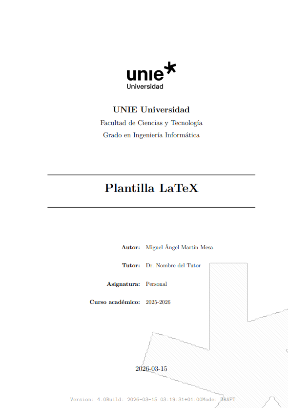

# UNIE LaTeX Academic Template

# Preview

Professional **modular LaTeX template** designed for academic and technical writing.

It provides a **clean architecture separating configuration, structure, and content**, allowing the author to focus entirely on writing.

Suitable for:

• University reports  
• Technical documentation  
• Final Degree Projects (TFG)  
• Research papers  
• Engineering documentation  

---

# Preview

Example document generated with the template:

📄 **Preview PDF**

[View Example Document](latex-template-example.pdf)

---

# Features

• Institutional academic cover  
• Modular project architecture  
• Automatic table of contents  
• Lists of figures, tables, code and algorithms  
• Professional typography  
• Bibliography with BibLaTeX (APA style)  
• Acronym management  
• Code listings with syntax highlighting  
• Algorithm environments  
• Documentation blocks (definitions, notes, warnings, examples)  
• Draft / Final build modes  
• Ready for GitHub + Overleaf workflows  

---

# Architecture

The template follows a **modular architecture inspired by software engineering practices**.

latex-university-template/

main.tex

00_config/
01_frontmatter/
02_chapters/
03_figures/
04_bibliography/
05_appendices/
06_styles/
07_acronyms/

| Folder | Purpose |
|------|------|
| `00_config` | Global configuration and packages |
| `01_frontmatter` | Cover, dedication, abstracts |
| `02_chapters` | Main document content |
| `03_figures` | Images and diagrams |
| `04_bibliography` | BibLaTeX reference database |
| `05_appendices` | Document appendices |
| `06_styles` | Typography and layout styles |
| `07_acronyms` | Acronym definitions |

This architecture ensures **clear separation of responsibilities** between document structure, configuration and content.

---

# Documentation

The template includes **integrated documentation explaining the architecture and usage**.

The generated document includes chapters such as:

• Introduction  
• Project Architecture  
• Writing Content  
• High-Level Floats  
• Code and Algorithms  
• Acronyms and Bibliography  
• Documentation Environments  
• Build Modes  
• Usage Guide  
• Best Practices  

This makes the repository not only a template but also a **learning resource for structured LaTeX projects**.

---

# Quick Start

Clone the repository:

git clone https://github.com/miguelmmesa/latex-university-template.git

Open the project with:

• Overleaf  
• VSCode + LaTeX Workshop  
• TeXStudio  
• TeXmaker  

Edit the configuration file:

00_config/config.tex

Configure:

• title  
• author  
• supervisor  
• university  
• academic year  

Write your document inside:

02_chapters/

---

# Open in Overleaf

1. Download the repository as a ZIP file  
2. Open **Overleaf**  
3. Click **New Project → Upload Project**  
4. Upload the ZIP file  

Overleaf will recreate the full project structure automatically.

---

# Example Output
# Continuous Compilation

You can preview the generated document here:
This repository includes **GitHub Actions** that automatically compile the LaTeX document.

[View Example PDF](latex-university-template.pdf)

---

# Continuous Compilation

This repository includes **GitHub Actions** that automatically compile the LaTeX document.

Every push will:

1. Compile the LaTeX project  
2. Generate the PDF  
3. Upload the compiled document as an artifact

Results can be viewed in the **Actions** tab.

---

# Author

Miguel Ángel Martín Mesa  
Computer Engineering Student  
UNIE University

Areas of interest:

• Software Engineering  
• System Architecture  
• Technical Documentation  
• Knowledge Systems  

This repository is part of a broader effort to build a **professional technical portfolio** including:

• GitHub engineering projects  
• Technical documentation systems  
• Knowledge architecture  
• Academic infrastructure tools  

Contact:

https://linktr.ee/miguelmmesa

---

# License

MIT License
